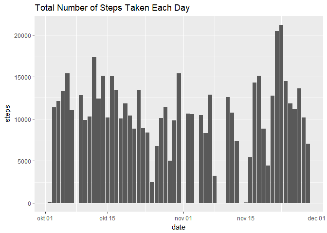
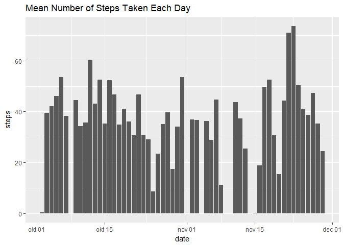
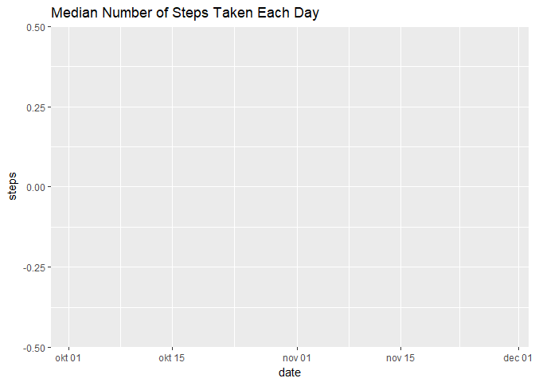
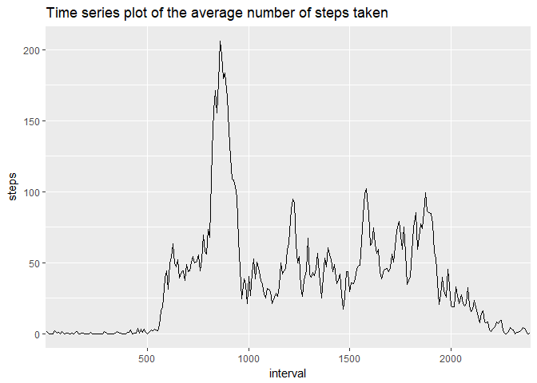
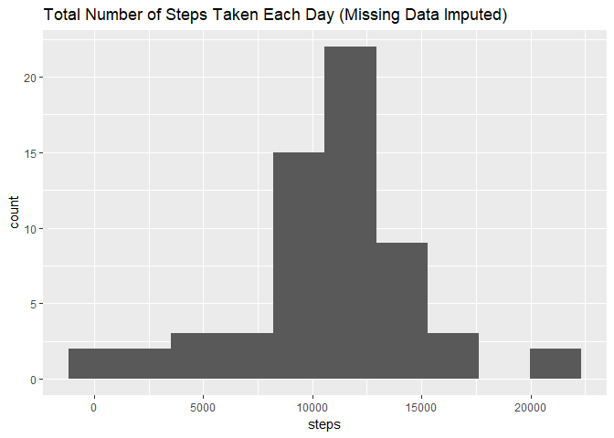
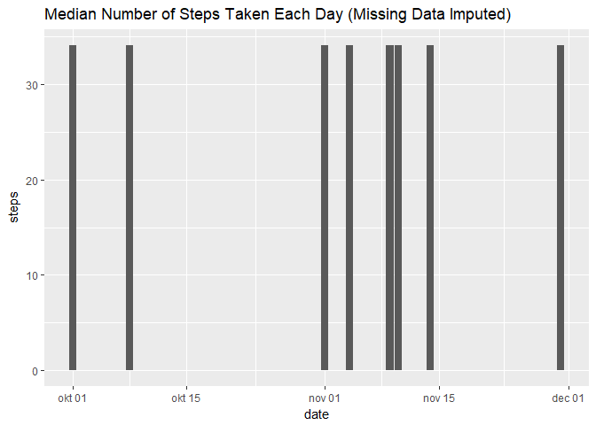
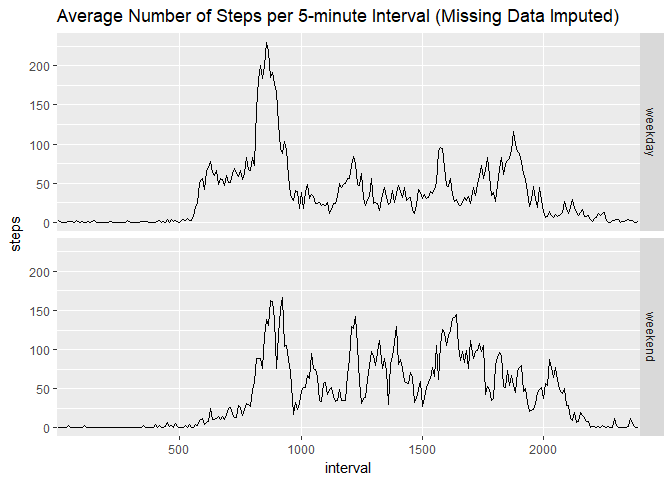

It is now possible to collect a large amount of data about personal movement using activity monitoring devices such as a Fitbit, Nike Fuelband, or Jawbone Up. These type of devices are part of the "quantified self" movement -- a group of enthusiasts who take measurements about themselves regularly to improve their health, to find patterns in their behavior, or because they are tech geeks. But these data remain under-utilized both because the raw data are hard to obtain and there is a lack of statistical methods and software for processing and interpreting the data.

This assignment makes use of data from a personal activity monitoring device. This device collects data at 5 minute intervals through out the day. The data consists of two months of data from an anonymous individual collected during the months of October and November, 2012 and include the number of steps taken in 5 minute intervals each day.

## 1 Loading and preprocessing the data
Show any code that is needed to
#### 1.1 Load the data (i.e. read.csv())

```r
file_name <- "activity.zip"
if (!file.exists(file_name)){
        file_url <- "https://d396qusza40orc.cloudfront.net/repdata%2Fdata%2Factivity.zip"
        download.file(file_url, file_name)
}  
if (!file.exists("activity.csv")) { 
        unzip(file_name) 
}  
data <- read.csv("activity.csv")
```

#### 1.2 Process/transform the data (if necessary) into a format suitable for your analysis

Transform date column into date class and interval into a factor class

```r
data$date <- as.Date(as.character(data$date), "%Y-%m-%d")
data$interval <- as.factor(data$interval)
```

## 2 What is mean total number of steps taken per day?
#### 2.1 Histogram of the total number of steps taken each day

```r
library(ggplot2)
data2 <- aggregate(steps ~ date, data=data, FUN=sum, na.rm = TRUE)
g <- ggplot(data2, aes(date, steps))
g + geom_bar(stat = "identity") + ggtitle("Total Number of Steps Taken Each Day")
```

<!-- -->

#### 2.2a Mean number of steps taken each day

```r
library(ggplot2)
data_mean_day <- aggregate(steps ~ date, data = data, FUN = mean, na.rm = TRUE)
g <- ggplot(data_mean_day, aes(date, steps))
g + geom_bar(stat = "identity") + ggtitle("Mean Number of Steps Taken Each Day")
```

<!-- -->

#### 2.2b Median number of steps taken each day

```r
library(ggplot2)
data_median_day <- aggregate(steps ~ date, data = data, FUN = median, na.rm = TRUE)
g <- ggplot(data_median_day, aes(date, steps))
g + geom_bar(stat = "identity") + ggtitle("Median Number of Steps Taken Each Day")
```

<!-- -->

## 3 What is the average daily activity pattern?
#### 3.1 Time series plot of the average number of steps taken

```r
library(ggplot2)
data3 <- aggregate(steps ~ interval, data = data, FUN = mean, na.rm = TRUE)
g <- ggplot(data3, aes(interval, steps, group = 1))
g + geom_line() + scale_x_discrete(breaks = c(500, 1000, 1500, 2000)) + ggtitle("Time series plot of the average number of steps taken")
```

<!-- -->

#### 3.2 The 5-minute interval that, on average, contains the maximum number of steps

```r
data3[which.max(data3$steps), ]
```

```
##     interval    steps
## 104      835 206.1698
```

```r
as.character(data3[which.max(data3$steps), ]$interval)
```

```
## [1] "835"
```

## 4 Imputing missing values
#### 4.1 Number of rows with missing data

```r
nrow(data[which(is.na(data)), ])
```

```
## [1] 2304
```

#### 4.2 Strategy for filling in all of the missing values in the dataset
Looking at the missing data reveals that entire days of data are missing, and not single random observations.

```r
head(data[which(is.na(data)) & data$date == "2012-10-01", ], 2)
```

```
## Warning in which(is.na(data)) & data$date == "2012-10-01": longer object
## length is not a multiple of shorter object length
```

```
##   steps       date interval
## 1    NA 2012-10-01        0
## 2    NA 2012-10-01        5
```

```r
tail(data[which(is.na(data)) & data$date == "2012-10-01", ], 2)
```

```
## Warning in which(is.na(data)) & data$date == "2012-10-01": longer object
## length is not a multiple of shorter object length
```

```
##     steps       date interval
## 287    NA 2012-10-01     2350
## 288    NA 2012-10-01     2355
```

```r
length(data[which(is.na(data)) & data$date == "2012-10-01", ]$steps)
```

```
## Warning in which(is.na(data)) & data$date == "2012-10-01": longer object
## length is not a multiple of shorter object length
```

```
## [1] 288
```

```r
head(data[data$date == "2012-10-02", ], 2)
```

```
##     steps       date interval
## 289     0 2012-10-02        0
## 290     0 2012-10-02        5
```

```r
tail(data[data$date == "2012-10-02", ], 2)
```

```
##     steps       date interval
## 575     0 2012-10-02     2350
## 576     0 2012-10-02     2355
```

```r
length(data[data$date == "2012-10-02", ]$steps)
```

```
## [1] 288
```

Number of intervals in a single day

```r
length(unique(data$interval))
```

```
## [1] 288
```

Devide the total missing number by number of intervals in a single day gives a total of 8 days

```r
nrow(data[which(is.na(data)), ])/length(unique(data$interval))
```

```
## [1] 8
```

#### 4.3 New dataset that is equal to the original dataset with missing data filled in
use the data from the time series plot of the average number of steps per 5-minute interval and impute this over the missing data

```r
data4 <- data
data4[which(is.na(data4)), ]$steps <- data3$steps
str(data)
```

```
## 'data.frame':	17568 obs. of  3 variables:
##  $ steps   : int  NA NA NA NA NA NA NA NA NA NA ...
##  $ date    : Date, format: "2012-10-01" "2012-10-01" ...
##  $ interval: Factor w/ 288 levels "0","5","10","15",..: 1 2 3 4 5 6 7 8 9 10 ...
```

```r
str(data4)
```

```
## 'data.frame':	17568 obs. of  3 variables:
##  $ steps   : num  1.717 0.3396 0.1321 0.1509 0.0755 ...
##  $ date    : Date, format: "2012-10-01" "2012-10-01" ...
##  $ interval: Factor w/ 288 levels "0","5","10","15",..: 1 2 3 4 5 6 7 8 9 10 ...
```

#### 4.4a Histogram of the total number of steps taken each day after missing values are imputed

```r
library(ggplot2)
new_data <- data4
new_data_total_day <- aggregate(steps ~ date, data = new_data, FUN = mean, na.rm = TRUE)
g <- ggplot(data2, aes(date, steps))
g + geom_bar(stat = "identity") + ggtitle("Total Number of Steps Taken Each Day")
```

<!-- -->

#### 4.4b Histogram of the mean number of steps taken each day after missing values are imputed

```r
library(ggplot2)
new_data_mean_day <- aggregate(steps ~ date, data = new_data, FUN = mean, na.rm = TRUE)
g <- ggplot(new_data_mean_day, aes(date, steps))
g + geom_bar(stat = "identity") + ggtitle("Mean Number of Steps Taken Each Day (Missing Data Imputed)")
```

<!-- -->

#### 4.4c Histogram of the median number of steps taken each day after missing values are imputed

```r
library(ggplot2)
new_data_median_day <- aggregate(steps ~ date, data = new_data, FUN = median, na.rm = TRUE)
g <- ggplot(new_data_median_day, aes(date, steps))
g + geom_bar(stat = "identity") + ggtitle("Median Number of Steps Taken Each Day (Missing Data Imputed)")
```

<!-- -->

Do these values differ from the estimates from the first part of the assignment? 
Mean and median dont differ from the first part of the assignment. Only difference is more days of data in the plot. Averages and medians are not effected by this.

What is the impact of imputing missing data on the estimates of the total daily number of steps?
The total number of daily steps has increased, but because whole days of data were missing the difference is that there are more days with data in the graphs. Daily totals are not affected. 

## 5 Are there differences in activity patterns between weekdays and weekends?
#### 5.1 Create a new factor variable in the dataset with two levels -- "weekday" and "weekend" indicating whether a given date is a weekday or weekend day.

```r
Sys.setlocale("LC_TIME", "English") # change datetime to english because my operating system language
data8 <- new_data
data8$weekday <- factor(weekdays(new_data$date))
levels(data8$weekday) <- list(weekday = c("Monday", "Tuesday", "Wednesday", "Thursday", "Friday"), weekend = c("Saturday", "Sunday"))
```

#### 5.2 Make a panel plot containing a time series plot (i.e. type = "l") of the 5-minute interval (x-axis) and the average number of steps taken, averaged across all weekday days or weekend days (y-axis).

```r
library(ggplot2)
mean_weekday <- aggregate(steps ~ interval + weekday, data = data8, FUN = mean, na.rm = TRUE)
g <- ggplot(mean_weekday, aes(interval, steps, group = 1))
g + geom_line() + facet_grid(weekday ~ .) + scale_x_discrete(breaks = c(500, 1000, 1500, 2000)) +
        ggtitle("Average Number of Steps per 5-minute Interval (Missing Data Imputed)")
```

<!-- -->
